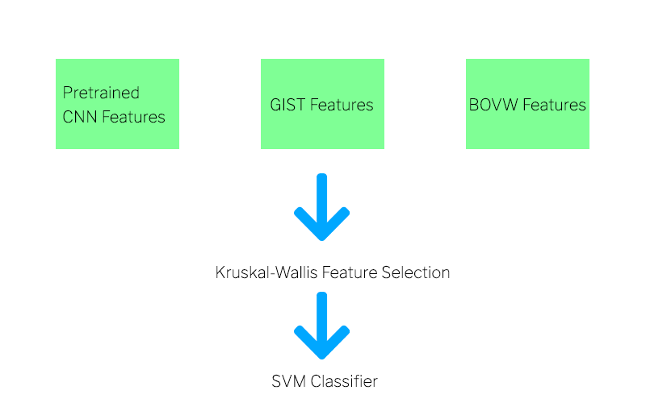

# Chest Pathology Identification
This repository contains Python implementation of the paper "Chest Pathology Identification using Deep Feature Selection with Non-Medical Training" [Original Paper](https://www.cs.tau.ac.il/~wolf/papers/chest_miccai2015.pdf)

The pipeline of the provided notebook can be visualized on the below image.

## To run the notebook perform the following steps:
1. Clone the repo.
2. Perform the steps to make matlab code compatable with Python code (as GIST feature extraction is performed in the matlab functions)
3. Run all notebook cells.
